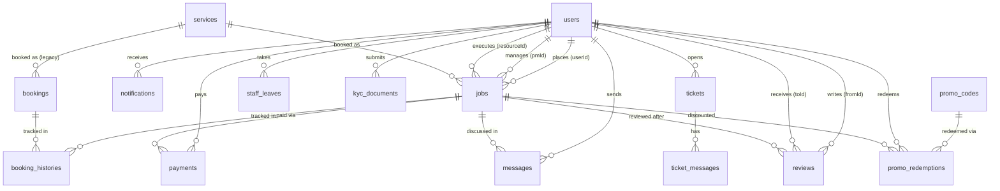

# Database Collections — QuickHire

**Database:** MongoDB (native driver, no ORM)  
**DB name:** `quickhire` (env: `MONGO_DB`)  
**Total collections:** 20

---

## Collection Inventory

| Collection | Owner Module | Approximate Scale | Notes |
|---|---|---|---|
| `users` | auth, user, admin, pool | Medium (10K-100K rows) | All human actors |
| `jobs` | job, booking, admin | High | Primary booking record (v3) |
| `bookings` | booking | Medium | Legacy v1/v2 records only |
| `booking_histories` | booking, lifecycle | High | Full audit trail |
| `payments` | payment | High | Razorpay order + status |
| `messages` | chat | Very High | All chat messages |
| `notifications` | notification | Very High | All notifications |
| `tickets` | ticket | Medium | Support tickets |
| `ticket_messages` | ticket, admin | Medium | Ticket chat thread |
| `services` | service, admin | Low (50-500 rows) | Service catalogue |
| `cms_content` | cms | Low | Key-value content blocks |
| `cms_articles` | cms, chatbot, search | Low-Medium | Long-form articles |
| `promo_codes` | promo | Low | Promo code definitions |
| `promo_redemptions` | promo | Medium | Per-booking usage records |
| `reviews` | review, scorecard | Medium | Post-booking ratings |
| `staff_leaves` | pool | Low | Leave records |
| `kyc_documents` | pool | Low | KYC file metadata |
| `countries` | i18n, geo | Very Low (10-50 rows) | Country config |
| `system_config` | availability, i18n | Very Low | System settings |
| `chat` | admin (booking chat) | Medium | Admin booking group chat |

---

## `users`

```js
{
  _id: ObjectId,
  mobile: "9999999999",          // PRIMARY key for auth (10 digits, no +91)
  role: "user" | "pm" | "resource" | "admin" | "ops" | "finance" | "support" | "growth" | "viewer" | "super_admin",
  name: "Rahul Sharma",
  email: "rahul@example.com",    // optional
  
  // Staff-only fields
  specialization: ["React", "Node"],
  skills: ["frontend", "typescript"],
  capacity: 5,                   // max concurrent bookings
  availabilityWindows: [
    { day: "MON", from: "09:00", to: "18:00" }
  ],
  bio: "...",
  city: "Mumbai",
  country: "IN",
  
  // Push notifications
  fcmTokens: [
    { token: "...", endpointArn: "arn:aws:sns:..." }
  ],
  
  meta: {
    isProfileComplete: true,
    status: "active" | "suspended" | "on_leave" | "deleted" | "inactive",
    kycVerified: false
  },
  
  deletedAt: Date,               // soft-delete for staff
  createdAt, updatedAt
}
```

**Note:** FE sends `role: "customer"` but DB stores `role: "user"`. Admin routes translate this: `filter.role = role === 'customer' ? 'user' : role`.

---

## `jobs` (primary booking collection)

```js
{
  _id: ObjectId,
  userId: ObjectId,              // customer
  serviceId: ObjectId,           // primary service reference
  services: [                    // v3 array (may have multiple services)
    {
      serviceId: ObjectId,
      technologyIds: [{ _id?, name }],
      selectedDays: 1,
      durationTime: 8,           // hours
      preferredStartDate: Date | "2026-05-01",
      preferredEndDate: Date,
      startTime: "09:00",
      endTime: "13:00",
      timeSlot: { startTime: "09:00", endTime: "13:00" },
      bookingType: "later" | "instant",
      status: "pending",
      requirements: "...",
      assignedResource: { _id, name, mobile },
      projectManager: { _id, name, mobile },
      chatSummary: {}
    }
  ],
  technologyIds: [],             // top-level for legacy consumers
  selectedDays: 1,
  requirements: "...",
  durationTime: 8,
  bookingType: "later" | "instant",
  title: "React Developer",      // flattened from service.name
  
  status: "pending" | "pending_payment" | "confirmed" | "paid" |
          "assigned_to_pm" | "in_progress" | "paused" |
          "completed" | "cancelled",
  
  pricing: {
    hourly: 800,
    subtotal: 6400,
    tax: 1152,
    total: 7552,
    currency: "INR",
    extensionTotal: 0,           // added on booking extension
    totalPaid: 7552
  },
  
  // Staff assignment
  pmId: ObjectId,
  projectManager: { _id, name, mobile },
  resourceId: ObjectId,
  assignedResource: { _id, name, mobile },
  
  // Timing
  paidAt: Date,
  startedAt: Date,               // PM starts work
  endReminderSentAt: Date,       // lifecycle tick dedup flag
  autoAssignedAt: Date,
  
  // Cancellation
  cancelReason: "",
  
  // Lifecycle logs
  logs: [{ by, role, type, message, at }],
  history: [{ at, actorRole, event, note }],
  
  createdAt, updatedAt
}
```

---

## `bookings` (legacy v1/v2)

```js
{
  _id: ObjectId,
  userId: ObjectId,
  serviceId: ObjectId,
  status: "pending" | "confirmed" | "assigned_to_pm" | "in_progress" | "paused" | "completed" | "cancelled",
  startTime: Date,
  endTime: Date,
  duration: 8,
  requirements: "",
  technologies: [],
  pricing: { subtotal, tax, total, currency },
  pmId: ObjectId,
  cancellation: { reason, by, at },
  createdAt, updatedAt
}
```

---

## `booking_histories`

```js
{
  _id: ObjectId,
  bookingId: ObjectId,           // references jobs._id or bookings._id
  serviceId: ObjectId,
  fromStatus: "pending" | null,
  toStatus: "confirmed",
  actor: { id: "userId" | "system", role: "user" | "admin" | "system" },
  note: "payment verified",
  at: Date
}
```

---

## `payments`

```js
{
  _id: ObjectId,
  userId: ObjectId,
  jobId: ObjectId,
  bookingId: ObjectId,           // may be absent for v3 jobs
  provider: "razorpay" | "mock",
  orderId: "order_abc123",
  paymentId: "pay_def456",
  amount: 7552,                  // INR (NOT paise)
  currency: "INR",
  status: "created" | "paid" | "failed",
  signatureValid: true,
  mock: true,                    // dev-only flag
  rawWebhookEvents: [{ id, type, at }],
  invoice: { url: "https://s3..." },
  createdAt, updatedAt
}
```

---

## `messages`

```js
{
  _id: ObjectId,
  roomId: "service_X_pending_Y" | "{pmId}_service_{serviceId}",
  serviceId: ObjectId,
  bookingId: ObjectId,
  senderId: ObjectId,
  senderRole: "user" | "pm" | "admin",
  msgType: 0,                    // 0=text, 1=attachment
  msg: "Hello",
  attachment: {
    url: "https://...",
    key: "chat/userId/abc-file.pdf",
    mime: "application/pdf",
    size: 102400,
    name: "brief.pdf"
  },
  firstMsg: 0,
  seenBy: [{ userId: ObjectId, at: Date }],
  deliveredTo: [],
  createdAt
}
```

---

## `notifications`

```js
{
  _id: ObjectId,
  userId: ObjectId,
  type: "BOOKING_CREATED" | "BOOKING_CONFIRMED" | "CHAT_MESSAGE" | ...,
  title: "Booking received",
  body: "Your booking has been received.",
  data: { bookingId: "..." },
  channels: ["in_app", "push"],
  read: false,
  readAt: Date,
  createdAt
}
```

---

## `services`

See [Module 3](#3-service----services) for full shape. Key points:
- `pricing` can be either a flat object (`{ hourly, currency }`) OR an array (`[{ country, currency, basePrice, tax, surgeRules }]`)
- `name` / `description` can be either a flat string OR an i18n object `{ en, hi, ar, ... }`
- `active: false` + `deletedAt` = soft-deleted

---

## `tickets`

```js
{
  _id: ObjectId,
  userId: ObjectId,
  subject: "Can't cancel booking",
  description: "...",
  bookingId: ObjectId,           // optional
  status: "open" | "in_progress" | "resolved" | "closed",
  createdAt, updatedAt
}
```

---

## `ticket_messages`

```js
{
  _id: ObjectId,
  ticketId: ObjectId,
  senderId: ObjectId,
  senderRole: "user" | "admin",
  msg: "...",
  createdAt
}
```

---

## `promo_codes`

```js
{
  _id: ObjectId,
  code: "SAVE20",
  type: "flat_off" | "pct_off" | "free_service" | "first_booking" | "referral" | "bogo",
  value: 200,                    // flat amount OR percentage
  description: "...",
  scope: {
    country: "IN",
    city: "Mumbai",
    serviceIds: [],
    userSegment: ["all"]
  },
  minCartValue: 500,
  maxDiscount: 1000,
  usageLimitTotal: 500,
  usageLimitPerUser: 1,
  validFrom: Date,
  validTo: Date,
  stackable: false,
  campaignId: "campaign_123",
  ownerId: "affiliate_456",
  active: true,
  usedCount: 42,
  createdBy: ObjectId,
  createdAt, updatedAt
}
```

---

## `promo_redemptions`

```js
{
  _id: ObjectId,
  codeId: ObjectId,
  userId: ObjectId,
  bookingId: ObjectId,
  discount: 200,
  currency: "INR",
  appliedAt: Date
}
```

---

## `reviews`

```js
{
  _id: ObjectId,
  fromId: ObjectId,              // reviewer (customer)
  toId: ObjectId,                // PM or resource
  bookingId: ObjectId,
  rating: 4,                     // 1-5
  text: "Great work!",
  moderationStatus: "approved" | "removed" | "pending",
  createdAt
}
```

---

## `staff_leaves`

```js
{
  _id: ObjectId,
  staffId: ObjectId,
  staffName: "Amit Kumar",
  staffRole: "pm" | "resource",
  from: Date,
  to: Date,
  reason: "...",
  type: "casual" | "sick" | "unpaid" | "other",
  status: "approved" | "revoked",
  approvedBy: ObjectId,
  conflictingBookings: 0,
  createdAt
}
```

---

## `kyc_documents`

```js
{
  _id: ObjectId,
  userId: ObjectId,
  type: "aadhaar" | "pan" | "passport" | "driving_license" | "other",
  fileUrl: "https://...",
  notes: "...",
  status: "pending" | "approved" | "rejected",
  submittedAt: Date,
  reviewedBy: ObjectId,
  reviewedAt: Date,
  createdAt
}
```

---

## `countries`

```js
{
  _id: ObjectId,
  code: "IN",
  currency: "INR",
  lang: "en",
  timezone: "Asia/Kolkata",
  gateways: ["razorpay"],
  active: true
}
```

---

## `system_config`

```js
// Scheduling config:
{
  key: "scheduling",
  slotCapacity: 5,
  holidays: ["2026-01-26", "2026-08-15"],
  updatedAt
}
```

---

## `cms_content`

```js
{
  _id: ObjectId,
  key: "homepage_hero" | "faqs" | "banners" | ...,
  items: [{ any structure }],
  updatedAt
}
```

---

## `cms_articles`

```js
{
  _id: ObjectId,
  slug: "how-to-hire-react-developer",
  title: "How to hire a React Developer",
  content: "...",
  lang: "en",
  status: "published" | "draft",
  tags: [],
  createdAt, updatedAt
}
```

---

## Entity Relationship Diagram (Mermaid)



---

## Missing Indexes (Critical Gap)

The codebase uses raw MongoDB driver without any index definitions in code. The following indexes **must** be created manually or via migration:

```js
// users
db.users.createIndex({ mobile: 1 }, { unique: true })
db.users.createIndex({ role: 1 })
db.users.createIndex({ "meta.status": 1 })

// jobs
db.jobs.createIndex({ userId: 1, status: 1, createdAt: -1 })
db.jobs.createIndex({ pmId: 1, status: 1 })
db.jobs.createIndex({ resourceId: 1, status: 1 })
db.jobs.createIndex({ status: 1, createdAt: -1 })
db.jobs.createIndex({ "services.serviceId": 1 })
db.jobs.createIndex({ preferredStartDate: 1, "timeSlot.startTime": 1 })

// payments
db.payments.createIndex({ orderId: 1 }, { unique: true })
db.payments.createIndex({ jobId: 1 })
db.payments.createIndex({ userId: 1, createdAt: -1 })

// messages
db.messages.createIndex({ roomId: 1, createdAt: -1 })
db.messages.createIndex({ senderId: 1 })

// notifications
db.notifications.createIndex({ userId: 1, read: 1, createdAt: -1 })

// booking_histories
db.booking_histories.createIndex({ bookingId: 1, at: 1 })

// tickets
db.tickets.createIndex({ userId: 1, status: 1 })
db.tickets.createIndex({ status: 1, createdAt: -1 })

// promo_redemptions
db.promo_redemptions.createIndex({ codeId: 1, userId: 1 })

// reviews
db.reviews.createIndex({ toId: 1, moderationStatus: 1 })
db.reviews.createIndex({ bookingId: 1 })
```
