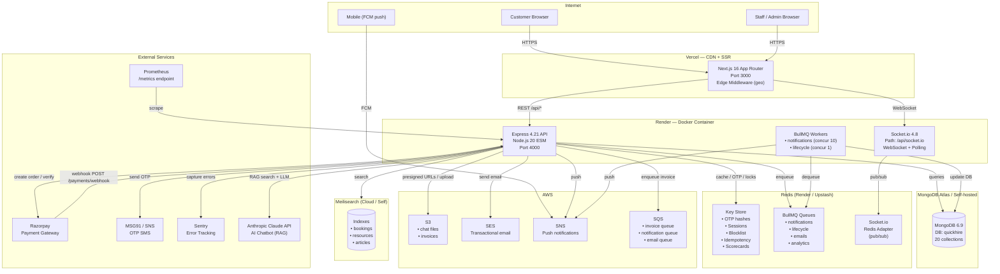

# System Topology Diagram

---

## Component Responsibilities

| Component | Responsibility |
|---|---|
| **Vercel / Next.js** | SSR, CDN, Edge geo-detection, 28 page routes |
| **Express API** | All business logic, REST endpoints, auth, booking, payments |
| **Socket.io** | Real-time chat + notifications (WS + polling, Redis adapter for multi-pod) |
| **BullMQ** | Async job processing — notifications, lifecycle ticks, emails, analytics |
| **MongoDB** | Source of truth — all persistent data (20 collections) |
| **Redis** | Speed layer — OTP, sessions, blocklist, locks, caches, queues |
| **Meilisearch** | Full-text search; degrades gracefully to MongoDB on unavailability |
| **S3** | Chat file uploads (25MB), invoice PDFs |
| **SES** | Transactional emails via SQS worker |
| **SNS** | Mobile push notifications via FCM endpoint ARNs |
| **SQS** | Secondary queue path for invoices/email/notifications |
| **Razorpay** | INR payment processing; webhook dedup via `rawWebhookEvents[]` |
| **MSG91** | OTP SMS delivery; falls back to console log on failure |
| **Sentry** | Unhandled error capture with user context |
| **Anthropic** | AI chatbot — RAG over Meilisearch `articles` index |
| **Prometheus** | Metrics scrape — HTTP durations, socket gauges, Node.js process |

---

## Network Ports & Paths

| Service | Port | Key Paths |
|---|---|---|
| Frontend (Vercel/local) | 3000 | All page routes |
| Backend API | 4000 | `/api/*`, `/healthz`, `/readyz`, `/metrics` |
| Socket.io | 4000 (shared) | `/api/socket.io` |
| MongoDB | 27017 | — |
| Redis | 6379 | — |
| Meilisearch | 7700 | — |
| Bull-Board | 4000 (admin) | `/admin/queues` |
