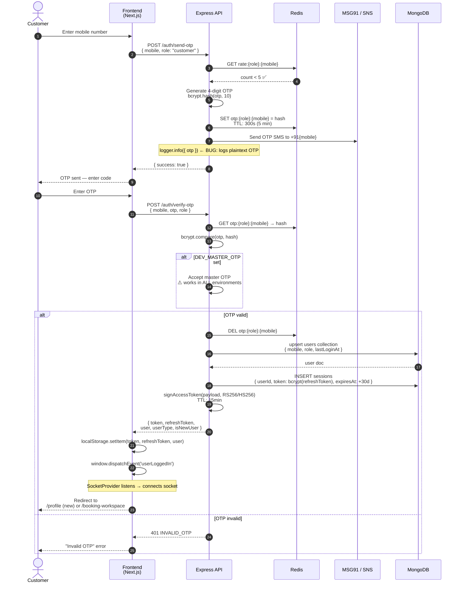
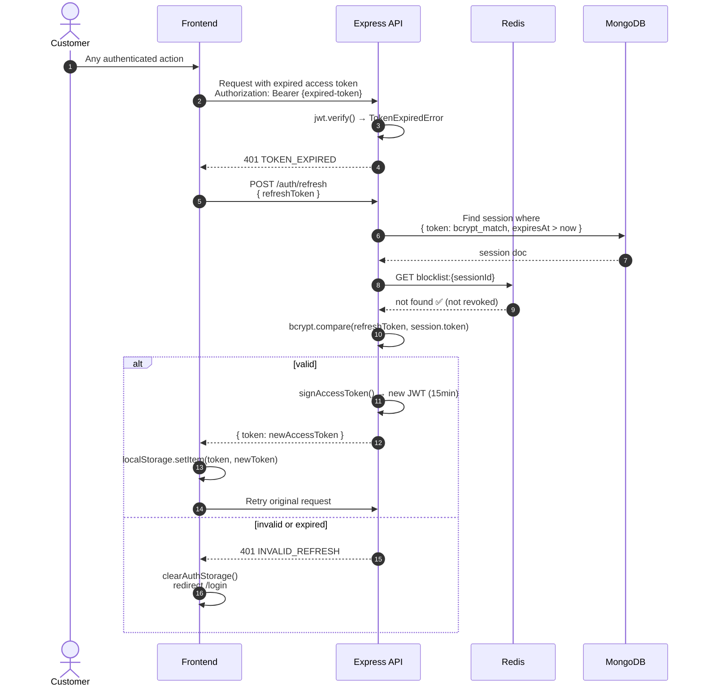
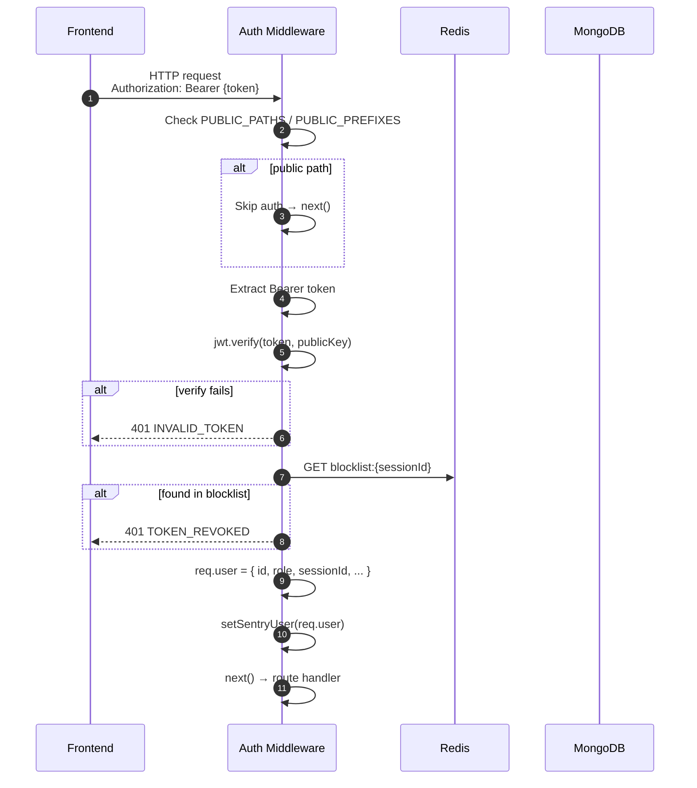
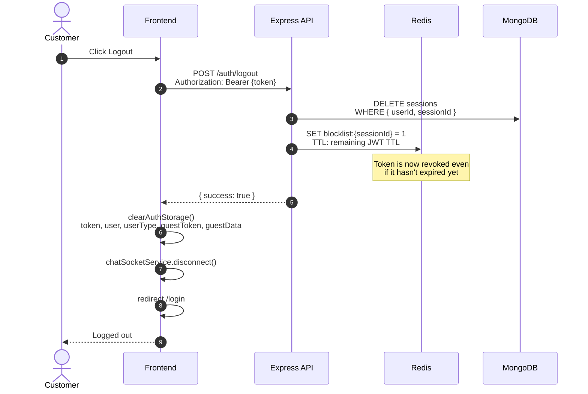
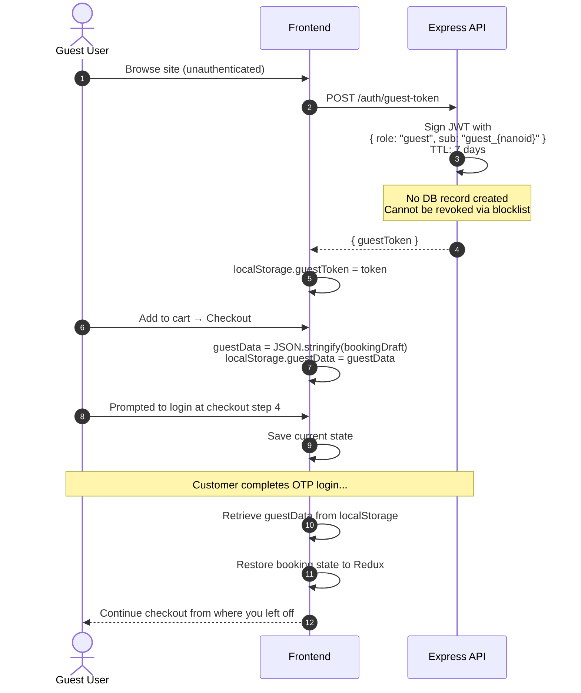

# Authentication Sequence Diagrams

---

## 1. Customer OTP Login

---

## 2. Token Refresh Flow

---

## 3. Request Authentication (Every Protected Request)

---

## 4. Logout Flow

---

## 5. Guest Access Flow

---

## Security Notes

| Mechanism | Implementation | Gap |
|---|---|---|
| OTP storage | `bcrypt.hash(otp, 10)` in Redis, TTL 5min | OTP also logged in plaintext (all envs) |
| OTP rate limit | 5 attempts / min via Redis counter | DEV_MASTER_OTP bypasses all checks in prod |
| Access tokens | RS256 JWT, 15min TTL | Stored in localStorage (XSS risk) |
| Refresh tokens | bcrypt hashed in MongoDB sessions | Not in Redis blocklist (slower revoke) |
| Logout revocation | Redis `blocklist:{sessionId}`, TTL = remaining JWT life | — |
| Guest revocation | **Not possible** — no sessionId, no blocklist entry | Stolen guest token valid for full 7 days |
| Algorithm | RS256 (PEM) default; auto-falls back to HS256 if key is short | Should force RS256 in production |
