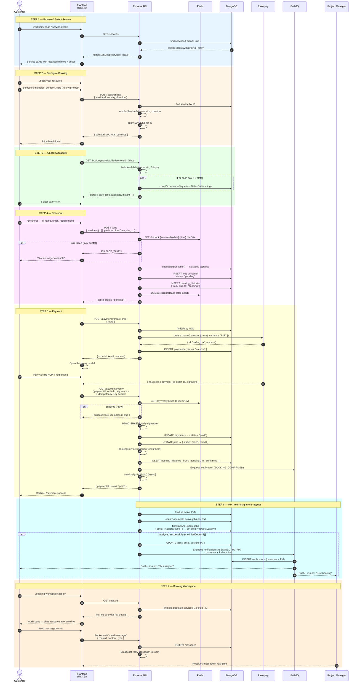
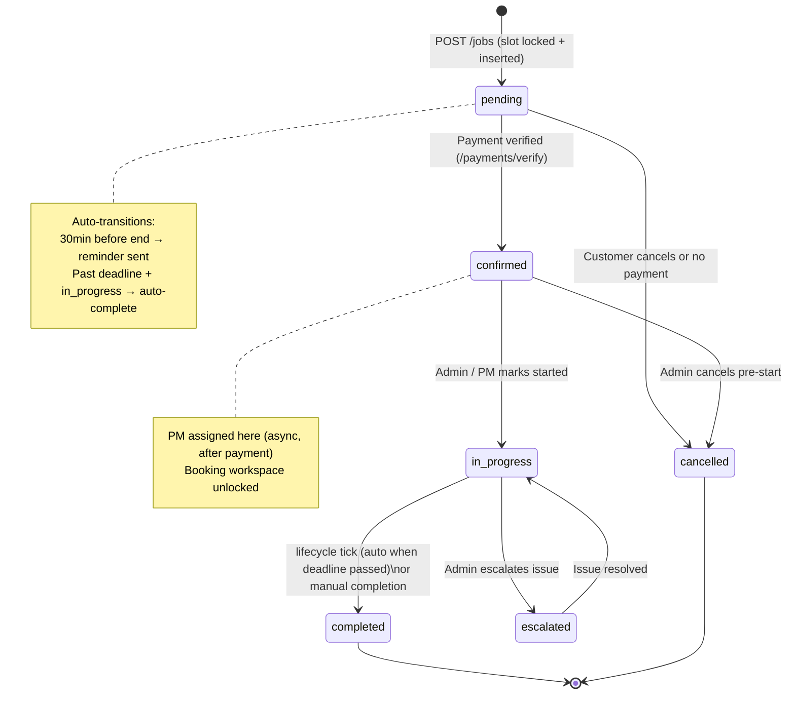
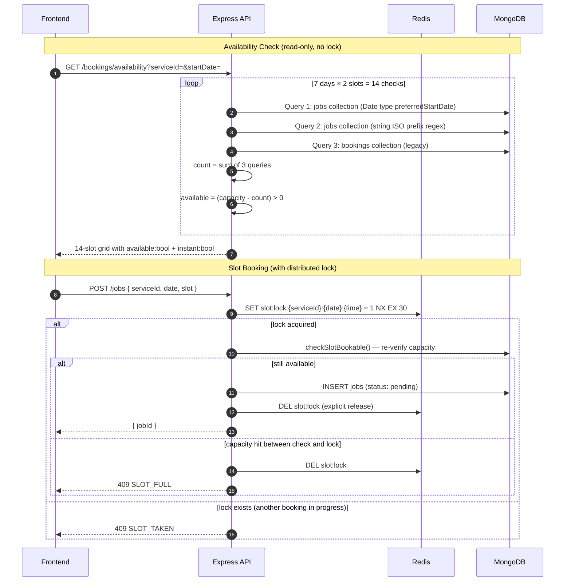
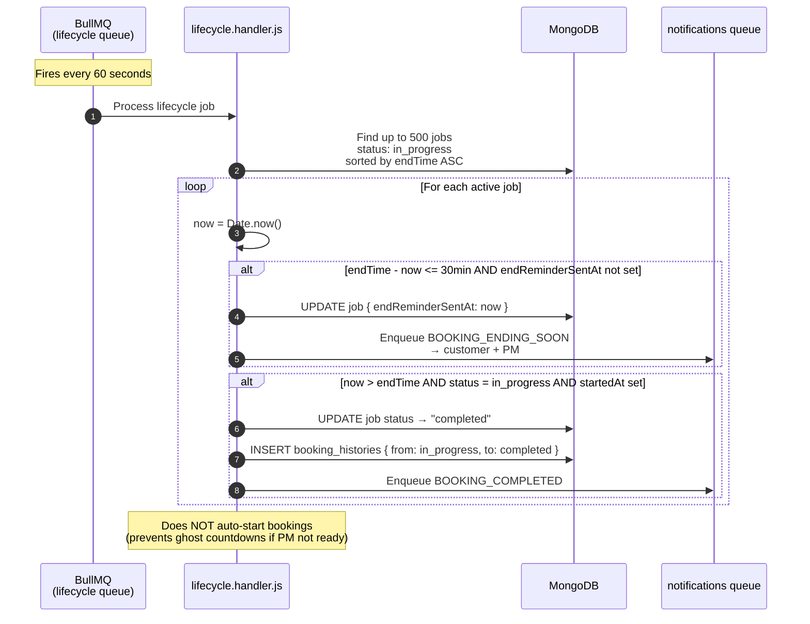
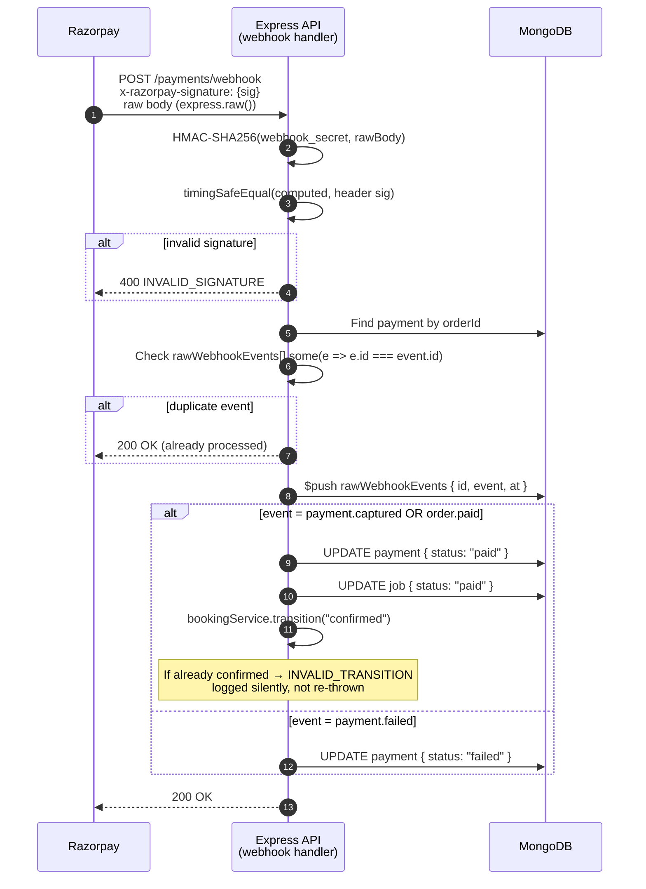

# Booking Flow Sequence Diagrams

---

## 1. End-to-End Customer Booking Journey

---

## 2. Booking State Machine

---

## 3. Slot Availability & Locking

---

## 4. Lifecycle Tick (BullMQ Repeating Job)

---

## 5. Razorpay Webhook (Dedup + Idempotency)

