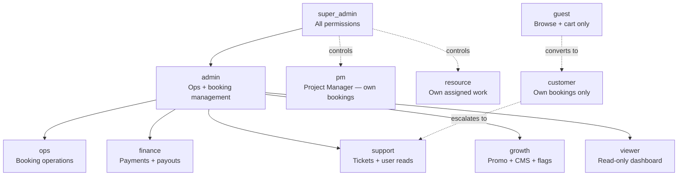

# Role & Permission Matrix

---

## Role Hierarchy



---

## Permission Groups

| Permission | Description |
|---|---|
| `BOOKING_READ` | View all bookings, histories, details |
| `BOOKING_WRITE` | Create, update, cancel, confirm, assign bookings |
| `REFUND_APPROVE` | Approve refund requests |
| `POOL_READ` | View staff pool profiles |
| `POOL_WRITE` | Add, update, approve staff; manage KYC, leaves |
| `USER_READ` | View customer profiles |
| `USER_WRITE` | Update customer records |
| `SERVICE_READ` | View service catalogue |
| `SERVICE_WRITE` | Create, update, delete services |
| `PAYMENT_READ` | View payment records |
| `PAYOUT_WRITE` | Trigger/approve payouts |
| `TICKET_READ` | View support tickets |
| `TICKET_WRITE` | Reply, resolve, assign tickets |
| `CMS_READ` | View CMS articles, FAQs |
| `CMS_WRITE` | Create, update, publish CMS content |
| `PROMO_READ` | View promo codes and analytics |
| `PROMO_WRITE` | Create, update, expire promo codes |
| `FLAG_READ` | View feature flags |
| `FLAG_WRITE` | Toggle feature flags |
| `AUDIT_READ` | View audit logs |
| `KYC_READ` | View KYC documents |
| `KYC_WRITE` | Approve/reject KYC |
| `RBAC_WRITE` | Manage role assignments |
| `DASHBOARD_READ` | View analytics dashboard |
| `FRAUD_READ` | View fraud / risk signals |
| `SCHEDULE_WRITE` | Update scheduling configuration |

---

## Role × Permission Matrix

| Permission | super_admin | admin | ops | finance | support | growth | viewer | pm | resource | customer | guest |
|---|:---:|:---:|:---:|:---:|:---:|:---:|:---:|:---:|:---:|:---:|:---:|
| `BOOKING_READ` | ✅ | ✅ | ✅ | ✅ | ✅ | — | ✅ | own | — | own | — |
| `BOOKING_WRITE` | ✅ | ✅ | ✅ | — | — | — | — | own | — | own | — |
| `REFUND_APPROVE` | ✅ | ✅ | — | ✅ | — | — | — | — | — | — | — |
| `POOL_READ` | ✅ | ✅ | ✅ | — | — | — | ✅ | — | — | — | — |
| `POOL_WRITE` | ✅ | ✅ | — | — | — | — | — | — | — | — | — |
| `USER_READ` | ✅ | ✅ | ✅ | — | ✅ | — | — | — | — | — | — |
| `USER_WRITE` | ✅ | ✅ | — | — | — | — | — | — | — | — | — |
| `SERVICE_READ` | ✅ | ✅ | ✅ | — | — | ✅ | ✅ | — | — | public | public |
| `SERVICE_WRITE` | ✅ | ✅ | — | — | — | — | — | — | — | — | — |
| `PAYMENT_READ` | ✅ | ✅ | — | ✅ | — | — | — | — | — | own | — |
| `PAYOUT_WRITE` | ✅ | ✅ | — | ✅ | — | — | — | — | — | — | — |
| `TICKET_READ` | ✅ | ✅ | — | — | ✅ | — | — | — | — | own | — |
| `TICKET_WRITE` | ✅ | ✅ | — | — | ✅ | — | — | — | — | create | — |
| `CMS_READ` | ✅ | ✅ | — | — | — | ✅ | ✅ | — | — | public | public |
| `CMS_WRITE` | ✅ | ✅ | — | — | — | ✅ | — | — | — | — | — |
| `PROMO_READ` | ✅ | ✅ | — | — | — | ✅ | ✅ | — | — | — | — |
| `PROMO_WRITE` | ✅ | ✅ | — | — | — | ✅ | — | — | — | — | — |
| `FLAG_READ` | ✅ | ✅ | — | — | — | ✅ | ✅ | — | — | — | — |
| `FLAG_WRITE` | ✅ | ✅ | — | — | — | — | — | — | — | — | — |
| `AUDIT_READ` | ✅ | ✅ | — | — | — | — | — | — | — | — | — |
| `KYC_READ` | ✅ | ✅ | ✅ | — | — | — | — | — | — | — | — |
| `KYC_WRITE` | ✅ | ✅ | — | — | — | — | — | — | — | — | — |
| `RBAC_WRITE` | ✅ | — | — | — | — | — | — | — | — | — | — |
| `DASHBOARD_READ` | ✅ | ✅ | ✅ | ✅ | — | ✅ | ✅ | — | — | — | — |
| `FRAUD_READ` | ✅ | ✅ | — | — | — | — | — | — | — | — | — |
| `SCHEDULE_WRITE` | ✅ | ✅ | — | — | — | — | — | — | — | — | — |

**Legend:** ✅ = full, `own` = their own records only, `public` = public data only, — = denied

---

## Route-Level Guards

### Backend Middleware Stack (per request)

```
authMiddleware          → req.user = { id, role, sessionId }
    ↓
requireRole([...roles]) → 403 if role not in list
    ↓
requirePerm([...perms]) → 403 if permission not granted
    ↓
adminGuard              → 403 if not in ADMIN_ROLES
    ↓
auditAdmin              → Logs admin action to audit_logs collection
```

### Route Guard Examples

| Route | Guard | Allowed Roles |
|---|---|---|
| `GET /admin/bookings` | `adminGuard` | super_admin, admin, ops, finance, support, growth, viewer |
| `PATCH /admin/bookings/:id/status` | `requirePerm(BOOKING_WRITE)` | super_admin, admin, ops |
| `POST /admin/services` | `requirePerm(SERVICE_WRITE)` | super_admin, admin |
| `POST /pool/staff/:id/kyc/approve` | `requirePerm(KYC_WRITE)` | super_admin, admin |
| `GET /scorecards/leaderboard` | `requireRole([admin, ops, ...])` | All admin roles |
| `GET /pm/bookings` | `requireRole(['pm'])` | pm only |
| `GET /resource/assignments` | `requireRole(['resource'])` | resource only |
| `POST /bookings` | `requireRole(['customer', 'guest'])` | customer, guest |
| `POST /payments/create-order` | `requireRole(['customer'])` | customer only |
| `GET /promo/redeem` | ⚠️ **No role guard** | Any authenticated user |

---

## Staff Roles vs Customer Roles

```mermaid
graph LR
    subgraph STAFF["ADMIN_ROLES (7)"]
        SA2[super_admin]
        AD2[admin]
        OP2[ops]
        FI2[finance]
        SU2[support]
        GR2[growth]
        VI2[viewer]
    end

    subgraph FIELD["Field Roles (2)"]
        PM2[pm]
        RS2[resource]
    end

    subgraph CUSTOMER_ROLES["Customer Roles (2)"]
        CU2[customer]
        GU2[guest]
    end

    subgraph PORTALS["Login Portals"]
        SP[/staff-login]
        CP[/login]
    end

    SP --> STAFF
    SP --> FIELD
    CP --> CUSTOMER_ROLES
```

**Key distinction:**
- Staff (admin roles + pm + resource) login via `/staff-login` → uses `staffApi.js` axios instance
- Customers login via `/login` → uses `axiosInstance.js`
- Both use the same `/auth/verify-otp` endpoint but the `role` field determines which user type is returned
