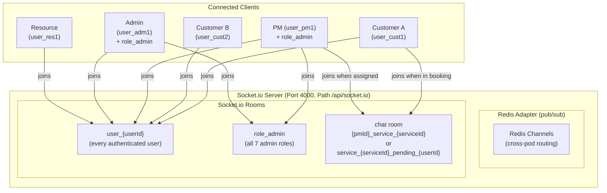
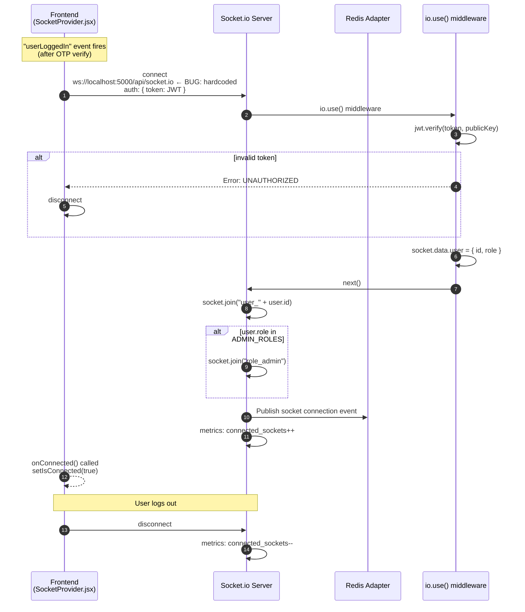
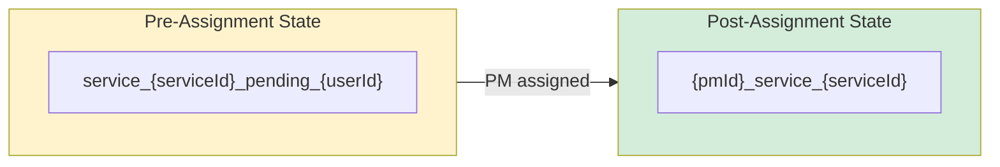
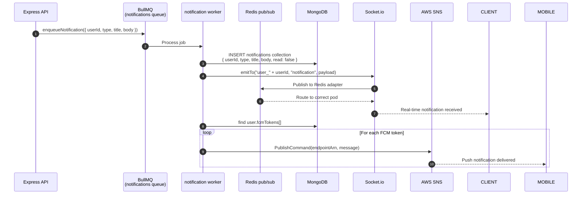
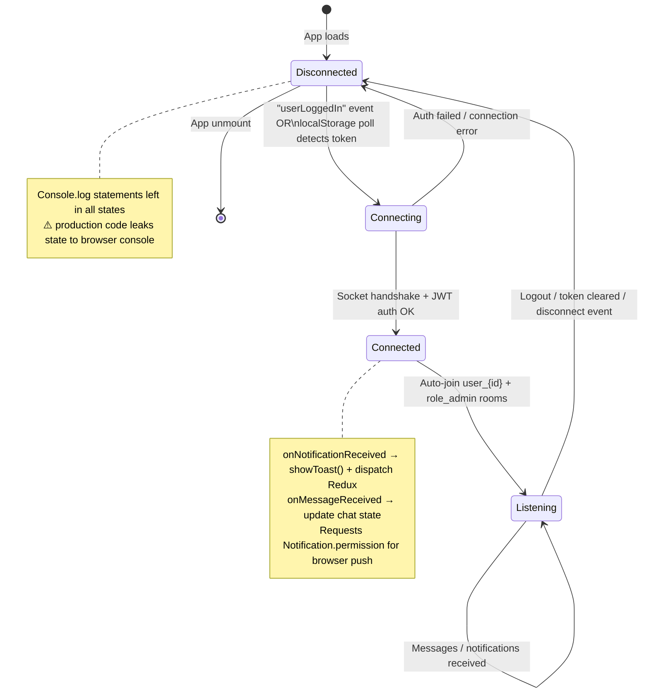

# Socket.io Room Topology

---

## Overview



---

## Connection Lifecycle



---

## Chat Room Naming Convention



**Room ID logic from `chat.service.js`:**
```
roomIdFor(pmId, serviceId, userId):
  if pmId is set:
    return "{pmId}_service_{serviceId}"   ← PM has been assigned
  else:
    return "service_{serviceId}_pending_{userId}"  ← awaiting PM
```

After PM assignment, the room ID changes. Both the customer and the PM must join the new room ID to continue chatting.

---

## Events Reference

### Server → Client Events

| Event | Room | Payload | When |
|---|---|---|---|
| `notification` | `user_{userId}` | `{ type, title, body, data }` | Any notification (BOOKING_CONFIRMED, ASSIGNED_TO_PM, etc.) |
| `notification:new` | `user_{userId}` | Same as above | Duplicate emit for backwards compat |
| `new-message` | chat room | `{ _id, roomId, senderId, content, type, createdAt }` | New chat message |
| `message-seen` | chat room | `{ messageId, userId, at }` | Message marked as seen |
| `booking:updated` | `user_{userId}` | `{ jobId, status, ... }` | Booking status changes |
| `pm:assigned` | `user_{userId}` | `{ jobId, pmId, pmName }` | PM assignment complete |

### Client → Server Events (chat.socket.js)

| Event | Handler | Action |
|---|---|---|
| `join-room` | `handleJoinRoom` | `socket.join(roomId)` — validates user is participant |
| `send-message` | `handleSendMessage` | Insert to `messages` collection + broadcast `new-message` |
| `mark-seen` | `handleMarkSeen` | `$addToSet seenBy` + broadcast `message-seen` |
| `typing` | `handleTyping` | Broadcast `typing` event to room (no DB persist) |
| `disconnect` | auto | Leave all rooms, decrement metrics gauge |

---

## Notification Fan-Out Pattern



---

## Multi-Pod Scaling via Redis Adapter

```mermaid
graph LR
    subgraph POD1["Pod 1 (Render instance 1)"]
        SIO1["Socket.io\nPod 1"]
        C1["Customer A\nconnected here"]
    end

    subgraph POD2["Pod 2 (Render instance 2)"]
        SIO2["Socket.io\nPod 2"]
        PM1["PM\nconnected here"]
    end

    subgraph REDIS["Redis"]
        PUBSUB["pub/sub channels\nper room"]
    end

    C1 -->|send message| SIO1
    SIO1 -->|publish to room channel| PUBSUB
    PUBSUB -->|subscribe| SIO2
    SIO2 -->|emit new-message| PM1

    Note: Customer A on Pod 1, PM on Pod 2 — message still delivered
```

**Critical:** The Redis adapter is already configured in `socket/index.js`. Multi-pod socket routing works out of the box on Render multi-instance deployments. The only blocker is the hardcoded `localhost:5000` in `SocketProvider.jsx` — fix this before any real deployment.

---

## Socket Client (SocketProvider.jsx) State Machine



---

## Known Bugs

| Bug | Location | Impact |
|---|---|---|
| `baseUrl: "http://localhost:5000"` hardcoded | `SocketProvider.jsx:69` | Socket never connects in any deployed environment |
| `console.log` with emojis in all state transitions | `SocketProvider.jsx:21,27,...` | Internal socket state exposed in browser console |
| Backend socket path `/api/socket.io` vs frontend path `/socket.io` | If mis-configured | 404 on socket handshake |
