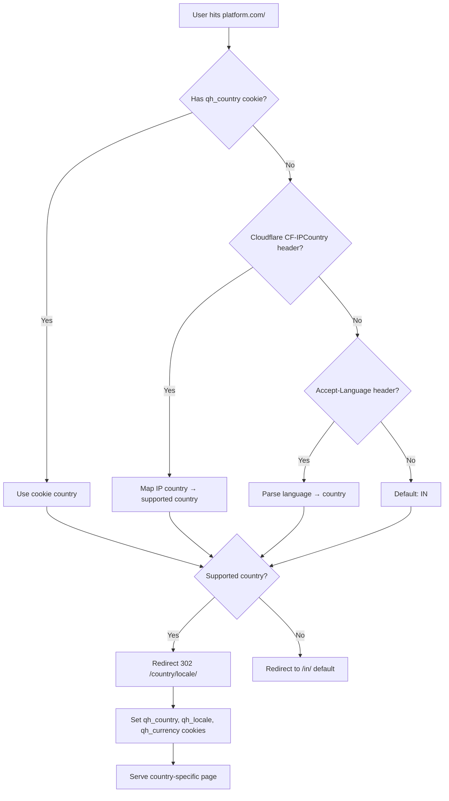

# 02 — URL & Domain Strategy

---

## Decision: Path Segments over Subdomains

**Use:** `platform.com/in/`, `platform.com/ae/`, `platform.com/de/`, `platform.com/us/`, `platform.com/au/`

**NOT:** `in.platform.com`, `ae.platform.com`

### Why Path Segments Win for SEO

| Factor | Path Segment `/in/` | Subdomain `in.` |
|---|---|---|
| Domain Authority | Single DA for all country versions | Split DA — each subdomain starts from zero |
| Link Equity | All backlinks flow to one root domain | Backlinks to `in.domain.com` don't help `ae.domain.com` |
| Google treatment | Same domain, different sections | Treated as separate websites (usually) |
| SSL management | One wildcard cert | Need cert per subdomain or wildcard |
| Deployment complexity | One codebase, path prefix | Potentially separate deployments |
| Google Search Console | One property, all countries | Separate properties needed |

---

## Complete URL Structure

```
https://platform.com/                          ← Auto-redirect to detected country
https://platform.com/in/                       ← India homepage (English)
https://platform.com/in/hi/                    ← India homepage (Hindi)
https://platform.com/ae/                       ← UAE homepage (English)
https://platform.com/ae/ar/                    ← UAE homepage (Arabic, RTL)
https://platform.com/de/                       ← Germany homepage (German)
https://platform.com/de/en/                    ← Germany homepage (English)
https://platform.com/us/                       ← USA homepage (English)
https://platform.com/us/es/                    ← USA homepage (Spanish)
https://platform.com/au/                       ← Australia homepage (English)

Content Pages:
https://platform.com/in/services/              ← Service catalogue (India)
https://platform.com/in/services/react-developer/  ← Service detail page
https://platform.com/in/freelancers/           ← Freelancer listing
https://platform.com/in/freelancers/john-doe-react/ ← Freelancer profile
https://platform.com/in/categories/web-development/  ← Category page

Legal Pages (country-specific):
https://platform.com/in/legal/terms-of-service/
https://platform.com/in/legal/privacy-policy/
https://platform.com/in/legal/refund-policy/
https://platform.com/de/legal/datenschutz/        ← German privacy (DSGVO)
https://platform.com/de/legal/impressum/           ← German legal notice (mandatory)
https://platform.com/de/legal/widerrufsrecht/      ← German withdrawal right

Auth Pages:
https://platform.com/in/login/
https://platform.com/in/signup/
https://platform.com/in/dashboard/

API (not country-routed — geo resolved via JWT/header):
https://api.platform.com/v1/...
```

---

## Next.js App Router Folder Structure for URL Segments

```
app/
├── [country]/                          ← Dynamic country segment: in, ae, de, us, au
│   ├── [locale]/                       ← Optional locale: hi, ar, de, es (omit for default)
│   │   ├── layout.tsx                  ← Locale-specific layout (RTL for ar)
│   │   ├── page.tsx                    ← Homepage
│   │   ├── services/
│   │   │   ├── page.tsx               ← Service catalogue
│   │   │   └── [slug]/
│   │   │       └── page.tsx           ← Individual service
│   │   ├── freelancers/
│   │   │   ├── page.tsx
│   │   │   └── [username]/page.tsx
│   │   ├── categories/
│   │   │   └── [slug]/page.tsx
│   │   ├── legal/
│   │   │   ├── [document]/page.tsx    ← Dynamic legal docs from CMS
│   │   └── dashboard/
│   │       └── (auth-required)/       ← Route group — auth guard
│   └── layout.tsx                     ← Country-level layout
├── layout.tsx                          ← Root layout
└── page.tsx                            ← Root redirect → detected country
```

---

## Geo-Detection & Redirect Flow



---

## hreflang Implementation (Critical for SEO)

Every page must emit `<link rel="alternate" hreflang="...">` tags in `<head>` for all country/locale variants of the same page.

```html
<!-- On /in/services/react-developer/ -->
<link rel="alternate" hreflang="en-IN" href="https://platform.com/in/services/react-developer/" />
<link rel="alternate" hreflang="hi-IN" href="https://platform.com/in/hi/services/react-developer/" />
<link rel="alternate" hreflang="en-AE" href="https://platform.com/ae/services/react-developer/" />
<link rel="alternate" hreflang="ar-AE" href="https://platform.com/ae/ar/services/react-developer/" />
<link rel="alternate" hreflang="de-DE" href="https://platform.com/de/services/react-developer/" />
<link rel="alternate" hreflang="en-DE" href="https://platform.com/de/en/services/react-developer/" />
<link rel="alternate" hreflang="en-US" href="https://platform.com/us/services/react-developer/" />
<link rel="alternate" hreflang="en-AU" href="https://platform.com/au/services/react-developer/" />
<link rel="alternate" hreflang="x-default" href="https://platform.com/in/services/react-developer/" />
```

Generated server-side via a `generateAlternates()` utility that queries which country/locale combos have content for a given slug.

---

## Country Code → Locale → Currency Mapping Table

```typescript
// config/countries.ts — The single source of truth for geo config

export const COUNTRY_CONFIG = {
  IN: {
    code: 'IN',
    name: 'India',
    defaultLocale: 'en',
    supportedLocales: ['en', 'hi'],
    currency: 'INR',
    currencySymbol: '₹',
    taxRate: 0.18,
    taxLabel: 'GST',
    taxInclusive: false,
    paymentGateways: ['razorpay', 'payu'],
    primaryGateway: 'razorpay',
    dateFormat: 'DD/MM/YYYY',
    numberFormat: 'en-IN',    // 1,00,000 (Indian numbering)
    phone: { code: '+91', pattern: /^\d{10}$/ },
    awsRegion: 'ap-south-1',
    dataResidency: 'ap-south-1',
    legalRegime: ['IT_ACT', 'CONSUMER_PROTECTION_ACT'],
    payoutMethods: ['bank_transfer', 'upi'],
    kycRequired: ['pan', 'aadhaar'],
    invoiceFields: ['pan', 'gstin'],
    direction: 'ltr',
  },
  AE: {
    code: 'AE',
    name: 'UAE',
    defaultLocale: 'en',
    supportedLocales: ['en', 'ar'],
    currency: 'AED',
    currencySymbol: 'AED',
    taxRate: 0.05,
    taxLabel: 'VAT',
    taxInclusive: false,
    paymentGateways: ['stripe', 'telr', 'paytabs'],
    primaryGateway: 'stripe',
    dateFormat: 'DD/MM/YYYY',
    numberFormat: 'en-AE',
    phone: { code: '+971', pattern: /^\d{9}$/ },
    awsRegion: 'me-central-1',
    dataResidency: 'me-central-1',
    legalRegime: ['UAE_CYBER_CRIME', 'PDPL'],
    payoutMethods: ['bank_transfer', 'wise'],
    kycRequired: ['emirates_id', 'trade_license'],
    invoiceFields: ['trn'],  // Tax Registration Number
    direction: 'ltr',        // default; ar locale switches to rtl
  },
  DE: {
    code: 'DE',
    name: 'Germany',
    defaultLocale: 'de',
    supportedLocales: ['de', 'en'],
    currency: 'EUR',
    currencySymbol: '€',
    taxRate: 0.19,
    taxLabel: 'MwSt.',
    taxInclusive: false,
    paymentGateways: ['stripe', 'sepa'],
    primaryGateway: 'stripe',
    dateFormat: 'DD.MM.YYYY',
    numberFormat: 'de-DE',   // 1.000,00 (German formatting)
    phone: { code: '+49', pattern: /^\d{10,11}$/ },
    awsRegion: 'eu-central-1',
    dataResidency: 'eu-central-1',
    legalRegime: ['GDPR', 'DSGVO', 'BGB', 'TELEMEDIA_ACT'],
    payoutMethods: ['sepa_transfer', 'wise'],
    kycRequired: ['passport', 'steuer_id'],
    invoiceFields: ['ust_id'],  // Umsatzsteuer-ID
    mandatoryPages: ['impressum', 'datenschutz', 'widerrufsrecht'],
    direction: 'ltr',
  },
  US: {
    code: 'US',
    name: 'United States',
    defaultLocale: 'en',
    supportedLocales: ['en', 'es'],
    currency: 'USD',
    currencySymbol: '$',
    taxRate: null,            // State-level via TaxJar API
    taxLabel: 'Sales Tax',
    taxInclusive: false,
    paymentGateways: ['stripe', 'braintree', 'ach'],
    primaryGateway: 'stripe',
    dateFormat: 'MM/DD/YYYY',
    numberFormat: 'en-US',
    phone: { code: '+1', pattern: /^\d{10}$/ },
    awsRegion: 'us-east-1',
    dataResidency: 'us-east-1',
    legalRegime: ['CCPA', 'COPPA', 'SOC2'],
    payoutMethods: ['ach', 'wire', 'paypal'],
    kycRequired: ['ssn_last4', 'ein'],
    invoiceFields: ['ein'],
    taxForms: ['W9', '1099-NEC'],
    direction: 'ltr',
  },
  AU: {
    code: 'AU',
    name: 'Australia',
    defaultLocale: 'en',
    supportedLocales: ['en'],
    currency: 'AUD',
    currencySymbol: 'A$',
    taxRate: 0.10,
    taxLabel: 'GST',
    taxInclusive: false,
    paymentGateways: ['stripe', 'pin_payments'],
    primaryGateway: 'stripe',
    dateFormat: 'DD/MM/YYYY',
    numberFormat: 'en-AU',
    phone: { code: '+61', pattern: /^\d{9}$/ },
    awsRegion: 'ap-southeast-2',
    dataResidency: 'ap-southeast-2',
    legalRegime: ['PRIVACY_ACT', 'CONSUMER_LAW'],
    payoutMethods: ['bsb_transfer', 'payid'],
    kycRequired: ['abn', 'tfn'],
    invoiceFields: ['abn'],
    direction: 'ltr',
  },
};
```

---

## User Country Override

Users can override their detected country with an explicit choice. This is stored in:
1. `users.preferred_country` column (authenticated users)
2. `qh_country` cookie (unauthenticated users)

The override is always respected over geo-detection. The UI provides a country switcher in the footer/nav that updates both.

---

## Sitemap Strategy

One `sitemap.xml` per country + locale, generated server-side:

```
https://platform.com/sitemap.xml              ← sitemap index
https://platform.com/in/sitemap.xml           ← India English sitemap
https://platform.com/in/hi/sitemap.xml        ← India Hindi sitemap
https://platform.com/ae/sitemap.xml
https://platform.com/ae/ar/sitemap.xml
https://platform.com/de/sitemap.xml
... (one per country × locale)
```

Each country sitemap includes:
- Homepage
- All service pages (with `lastmod` from CMS)
- All freelancer profile pages
- Category pages
- Legal pages
- Blog/help articles
