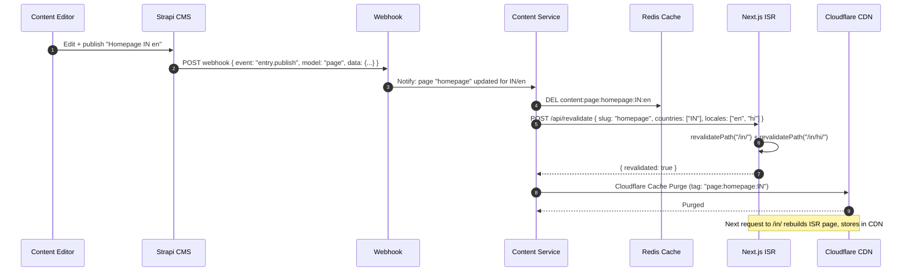

# 06 — CMS Architecture

---

## CMS-First Design

Every piece of user-visible content is owned by the CMS. The application is a rendering engine; the CMS is the brain.

```
What lives in CMS:
✅ All page copy (hero text, section text, CTAs)
✅ All service titles and descriptions
✅ All category names
✅ FAQ content
✅ Blog / help articles
✅ Legal documents (T&C, Privacy, etc.)
✅ Notification templates (email, SMS, push)
✅ Translation keys and values
✅ Feature flags descriptions
✅ Country-specific banners and promotions
✅ SEO metadata per page

What does NOT live in CMS:
❌ Business logic (pricing formulas, tax rates) → in code / country config
❌ User data (profiles, bookings) → in PostgreSQL
❌ Application configuration (DB URLs, secrets) → in Secrets Manager
❌ Code-level i18n (button labels) → in translation DB served via Translation Service
```

---

## CMS Choice: Strapi v5

Strapi v5 with PostgreSQL as its database. Admin UI served at `cms.platform.com` (Cloudflare Access protected).

```
cms.platform.com  ← Admin panel (staff only)
                  ← Content types management
                  ← Media library
                  ← Translation manager
                  ← Legal document editor
                  ← SEO editor
                  ← Webhook configuration

platform.com/api/content/* ← Content Service API (proxies Strapi → caches → serves frontend)
```

---

## Content Type Definitions

### Pages

```typescript
// CMS content type: "Page"
{
  slug: string,                   // "homepage", "how-it-works"
  title: string,                  // Internal admin label
  country_codes: string[],        // ["IN", "AE"] or ["ALL"]
  locale: string,                 // "en", "hi", "ar", "de"
  seo: {
    meta_title: string,
    meta_description: string,
    og_image: Media,
    canonical_url: string,
    no_index: boolean,
  },
  blocks: Block[],                // Array of content blocks (see below)
  published_at: DateTime,
  status: "draft" | "published" | "archived"
}
```

### Content Blocks (Page Builder)

```typescript
// Every block has a type and its type-specific data
type Block =
  | HeroBannerBlock
  | ServiceGridBlock
  | TestimonialCarouselBlock
  | FaqAccordionBlock
  | RichTextBlock
  | CtaSectionBlock
  | StatsRowBlock
  | VideoEmbedBlock
  | ImageGalleryBlock
  | PricingTableBlock
  | TrustBadgesBlock
  | FreelancerShowcaseBlock
  | CategoryGridBlock
  | BannerBlock;

interface HeroBannerBlock {
  type: "hero_banner";
  visibility: VisibilityRules;
  data: {
    headline: string;             // Localized text
    subheadline: string;
    cta_primary: { label: string; url: string };
    cta_secondary?: { label: string; url: string };
    background_image: Media;
    background_video?: Media;
    style: "centered" | "left_aligned" | "split";
  };
}

interface ServiceGridBlock {
  type: "service_grid";
  visibility: VisibilityRules;
  data: {
    title: string;
    subtitle?: string;
    service_ids?: string[];       // Handpicked services, or...
    category_id?: string;         // ...auto-pull from category
    limit: number;
    cta?: { label: string; url: string };
  };
}

interface VisibilityRules {
  countries: string[] | null;     // null = all countries
  locales: string[] | null;
  date_from: DateTime | null;
  date_to: DateTime | null;
  user_segments: string[] | null; // null = all users; "new_user", "freelancer", "client"
}
```

### Services

```typescript
// CMS content type: "Service"
{
  slug: string,
  category: Category,
  country_codes: string[],        // Which countries this service is available in
  // All text fields are multi-locale in Strapi v5
  title: { en: string, hi?: string, ar?: string, de?: string },
  description: { en: string, ... },
  short_description: { en: string, ... },
  what_you_get: string[],         // Bullet points
  requirements: string[],
  faq: { question: string, answer: string }[],
  gallery: Media[],
  icon: Media,
  tags: string[],
  pricing: {
    // Configured per country via Pricing collection
  },
  seo: SEOFields,
  featured: boolean,
  status: "draft" | "published",
}
```

### Legal Documents

```typescript
// CMS content type: "LegalDocument"
{
  type: string,                   // "terms_of_service", "impressum"
  country_code: string,           // "IN", "DE", "US"
  locale: string,                 // "en", "de", "hi"
  version: string,                // "v2.0"
  is_material_change: boolean,    // True = re-prompt existing users
  effective_date: Date,
  title: string,
  content: RichText,              // Full HTML body
  summary: string,                // Plain language summary
  changelog: string,              // Bullet list of changes from previous version
  status: "draft" | "legal_review" | "approved" | "published" | "archived",
}
// Publish → webhook to Legal Service → archives old, publishes new, purges cache
```

### Notification Templates

```typescript
// CMS content type: "NotificationTemplate"
{
  type: string,                   // "booking.created.email"
  channel: "email" | "sms" | "push" | "in_app",
  country_codes: string[],
  locale: string,
  subject: string,                // Email subject (Handlebars)
  body_html: RichText,            // Email body HTML
  body_text: string,              // Plain text fallback
  push_title: string,
  push_body: string,
  available_variables: string[],  // Docs for content team: [client_name, amount, ...]
}
```

---

## CMS Roles & Permissions

```typescript
// Strapi v5 role configuration
const CMS_ROLES = {
  "super_admin": {
    access: "all",
  },
  "content_editor": {
    can_edit: ["pages", "services", "categories", "faqs", "blog", "notifications"],
    cannot_edit: ["legal_documents", "pricing", "feature_flags"],
    can_publish: true,
  },
  "legal_editor": {
    can_edit: ["legal_documents"],
    cannot_edit: ["pages", "services", "pricing"],
    can_publish: false,           // Requires "legal_approver" to publish
  },
  "legal_approver": {
    can_edit: ["legal_documents"],
    can_publish: ["legal_documents"],  // Only legal documents
  },
  "translator": {
    can_edit: ["translations"],   // Translation manager only
    cannot_publish: true,         // Requires "translation_reviewer"
  },
  "seo_editor": {
    can_edit: ["pages.seo", "services.seo"],
    cannot_edit: ["page.blocks", "service content"],
  },
};
```

---

## CMS → Frontend Publishing Flow



---

## CMS API Response Caching

```typescript
// Content Service caching strategy

class ContentService {
  async getPage(slug: string, country: string, locale: string) {
    const cacheKey = `content:page:${slug}:${country}:${locale}`;

    // L1: Redis (hot cache, 1h TTL)
    const cached = await this.redis.get(cacheKey);
    if (cached) return JSON.parse(cached);

    // L2: Fetch from Strapi CMS
    const page = await this.strapi.findOne('pages', {
      filters: { slug, country_codes: { $in: [country, 'ALL'] } },
      locale,
      populate: 'deep',           // Populate all nested relations
    });

    // Apply visibility filtering (server-side, before caching)
    page.blocks = page.blocks.filter(block =>
      this.isVisible(block.visibility, country, locale)
    );

    // Cache in Redis (1h)
    await this.redis.setex(cacheKey, 3600, JSON.stringify(page));

    return page;
  }
}
```

---

## Media Management

```
Upload path:
  CMS admin uploads → Strapi media library → S3 bucket → Cloudflare Images CDN

URL format:
  https://media.platform.com/services/react-developer-hero.webp
  https://media.platform.com/services/react-developer-hero.webp?w=800&f=webp&q=85

Cloudflare Images transformation params:
  w=  width
  h=  height
  f=  format (webp, avif, auto)
  q=  quality (1-100)
  fit= contain | cover | crop

Storage:
  S3 bucket: platform-media-{region}
  Path structure:
    services/{slug}/{filename}
    categories/{slug}/{filename}
    pages/{slug}/{block-type}/{filename}
    users/{userId}/avatar/{filename}
    legal/{country}/{document-type}/{filename}
```
