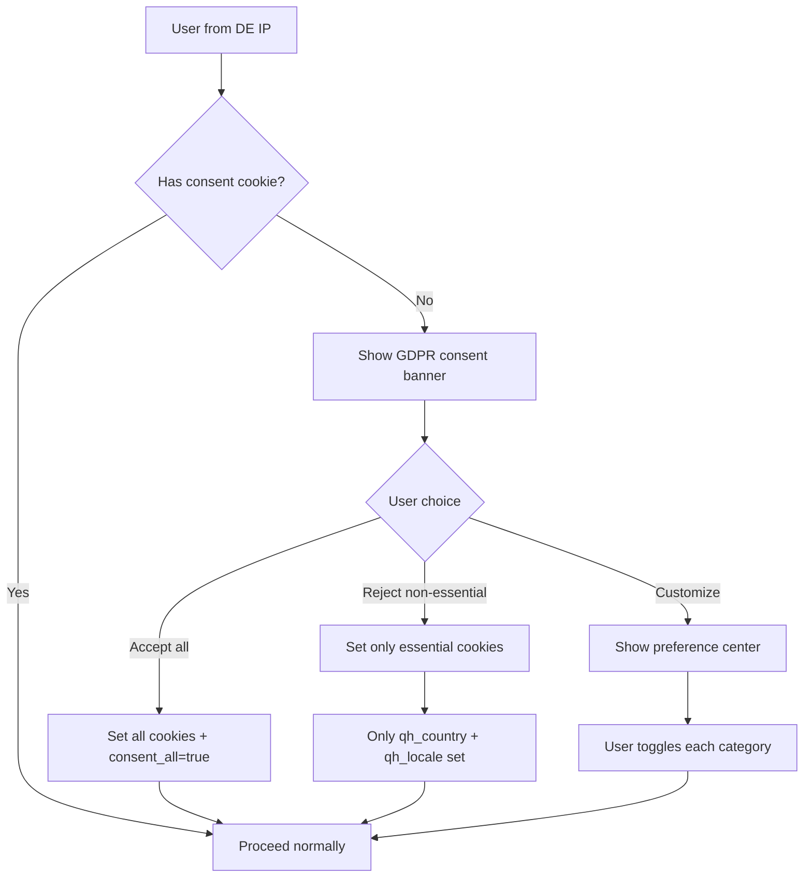

# 09 — Geo-Detection & Routing

---

## Three-Layer Geo Resolution

```
Layer 1: Cloudflare Edge Worker  ← Fires before request reaches origin
Layer 2: Next.js Edge Middleware ← Fires at the CDN edge (Vercel)
Layer 3: API Request Context     ← Every backend service call carries country
```

---

## Layer 1 — Cloudflare Worker (Primary Geo Resolver)

```typescript
// cloudflare-worker/geo.ts
// Deployed to Cloudflare Workers — runs at 200+ edge locations globally

export default {
  async fetch(request: Request, env: Env): Promise<Response> {
    const url = new URL(request.url);

    // Priority 1: Explicit country in URL path (highest trust)
    const pathCountry = extractCountryFromPath(url.pathname); // /in/ → 'IN'
    if (pathCountry && SUPPORTED_COUNTRIES.has(pathCountry)) {
      return addGeoHeaders(request, pathCountry, env);
    }

    // Priority 2: User's saved preference cookie
    const cookieCountry = getCookie(request, 'qh_country');
    if (cookieCountry && SUPPORTED_COUNTRIES.has(cookieCountry)) {
      return redirectToCountryPath(url, cookieCountry, request);
    }

    // Priority 3: Cloudflare's own IP geolocation (most accurate)
    const cfCountry = request.cf?.country;
    if (cfCountry && SUPPORTED_COUNTRIES.has(cfCountry)) {
      return redirectToCountryPath(url, cfCountry, request);
    }

    // Priority 4: Accept-Language header
    const acceptLanguage = request.headers.get('Accept-Language');
    const langCountry = resolveCountryFromLanguage(acceptLanguage);
    if (langCountry) {
      return redirectToCountryPath(url, langCountry, request);
    }

    // Fallback: India
    return redirectToCountryPath(url, 'IN', request);
  }
};

function redirectToCountryPath(url: URL, country: string, request: Request): Response {
  const locale = COUNTRY_CONFIG[country].defaultLocale;
  const newUrl = new URL(`/${country.toLowerCase()}${url.pathname}`, url.origin);

  const response = Response.redirect(newUrl.toString(), 302);

  // Set cookies on redirect
  response.headers.append('Set-Cookie',
    `qh_country=${country}; Path=/; Max-Age=31536000; SameSite=Lax; Secure`
  );
  response.headers.append('Set-Cookie',
    `qh_locale=${locale}; Path=/; Max-Age=31536000; SameSite=Lax; Secure`
  );
  response.headers.append('Set-Cookie',
    `qh_currency=${COUNTRY_CONFIG[country].currency}; Path=/; Max-Age=31536000; SameSite=Lax; Secure`
  );

  return response;
}

function addGeoHeaders(request: Request, country: string, env: Env): Promise<Response> {
  // Pass geo context to origin as headers (not cookies — headers are per-request)
  const newRequest = new Request(request, {
    headers: {
      ...Object.fromEntries(request.headers),
      'X-QH-Country': country,
      'X-QH-Locale': COUNTRY_CONFIG[country].defaultLocale,
      'X-QH-Currency': COUNTRY_CONFIG[country].currency,
      'X-QH-Timezone': request.cf?.timezone ?? 'UTC',
      'X-Real-IP': request.headers.get('CF-Connecting-IP') ?? '',
    },
  });
  return env.ORIGIN.fetch(newRequest);
}
```

---

## Layer 2 — Next.js Edge Middleware

```typescript
// middleware.ts (runs at Vercel edge, after Cloudflare)

import { NextRequest, NextResponse } from 'next/server';
import { SUPPORTED_COUNTRIES, COUNTRY_CONFIG } from './config/countries';

export function middleware(request: NextRequest) {
  const pathname = request.nextUrl.pathname;

  // Skip: static files, API routes, Next.js internals
  if (
    pathname.startsWith('/_next') ||
    pathname.startsWith('/api') ||
    pathname.includes('.')
  ) {
    return NextResponse.next();
  }

  // Read country from Cloudflare-injected header (Layer 1 already resolved)
  const country = (
    request.headers.get('X-QH-Country') ||
    request.cookies.get('qh_country')?.value ||
    'IN'
  ).toUpperCase();

  // Extract locale from path
  const pathSegments = pathname.split('/').filter(Boolean);
  const pathCountry = pathSegments[0]?.toUpperCase();
  const pathLocale = pathSegments[1];

  const countryConfig = COUNTRY_CONFIG[country];
  if (!countryConfig) {
    return NextResponse.redirect(new URL('/in/', request.url));
  }

  // If path has valid country segment, inject locale context
  if (SUPPORTED_COUNTRIES.has(pathCountry)) {
    const locale = countryConfig.supportedLocales.includes(pathLocale)
      ? pathLocale
      : countryConfig.defaultLocale;

    const response = NextResponse.next();

    // Inject into request headers for server components to read
    response.headers.set('x-country', country);
    response.headers.set('x-locale', locale);
    response.headers.set('x-currency', countryConfig.currency);
    response.headers.set('x-direction', locale === 'ar' ? 'rtl' : 'ltr');

    return response;
  }

  // No country in path → redirect
  const locale = countryConfig.defaultLocale;
  return NextResponse.redirect(
    new URL(`/${country.toLowerCase()}/${pathname}`, request.url)
  );
}

export const config = {
  matcher: ['/((?!_next/static|_next/image|favicon.ico).*)'],
};
```

---

## Layer 3 — API Request Context

Every API call from the frontend includes country context. The backend picks it up via:

```typescript
// In NestJS — CountryInterceptor
@Injectable()
export class CountryInterceptor implements NestInterceptor {
  intercept(context: ExecutionContext, next: CallHandler) {
    const request = context.switchToHttp().getRequest<Request>();

    // Order of precedence:
    const country =
      request.headers['x-qh-country'] ||    // Cloudflare-injected
      request.user?.country_code ||          // Auth token claim
      request.query.country ||               // Explicit query param (admin)
      'IN';                                  // Fallback

    request.geo = {
      country: country.toUpperCase(),
      locale: request.headers['x-qh-locale'] || 'en',
      currency: COUNTRY_CONFIG[country]?.currency || 'INR',
      timezone: request.headers['x-qh-timezone'] || 'UTC',
    };

    return next.handle();
  }
}
```

---

## Country Switcher (User-Initiated)

When a user manually switches country in the footer/nav:

```typescript
// Frontend: CountrySwitcher component

async function switchCountry(newCountry: string) {
  // 1. Update preference in backend (for authenticated users)
  if (isAuthenticated) {
    await api.patch('/v1/users/me/preferences', {
      preferred_country: newCountry,
      preferred_locale: COUNTRY_CONFIG[newCountry].defaultLocale,
      preferred_currency: COUNTRY_CONFIG[newCountry].currency,
    });
  }

  // 2. Set cookies (for all users)
  setCookie('qh_country', newCountry, { maxAge: 365 * 24 * 3600 });
  setCookie('qh_locale', COUNTRY_CONFIG[newCountry].defaultLocale, { maxAge: 365 * 24 * 3600 });
  setCookie('qh_currency', COUNTRY_CONFIG[newCountry].currency, { maxAge: 365 * 24 * 3600 });

  // 3. Navigate to same page in new country
  const newPath = currentPath.replace(/^\/(in|ae|de|us|au)/, `/${newCountry.toLowerCase()}`);
  router.push(newPath);
}
```

---

## Geo-IP Fallback Chain

For cases where Cloudflare geo-IP is unavailable (self-hosted or non-Cloudflare):

```typescript
// geo-service/src/detect.service.ts

async detectCountry(ip: string, headers: Record<string, string>): Promise<string> {
  // 1. Cloudflare header (most reliable)
  if (headers['cf-ipcountry']) return headers['cf-ipcountry'];

  // 2. Vercel header
  if (headers['x-vercel-ip-country']) return headers['x-vercel-ip-country'];

  // 3. MaxMind GeoLite2 database lookup (self-hosted)
  if (ip && this.geoip) {
    const result = this.geoip.country(ip);
    if (result?.country?.isoCode) return result.country.isoCode;
  }

  // 4. ipapi.co API (rate-limited external fallback)
  try {
    const data = await fetch(`https://ipapi.co/${ip}/json/`).then(r => r.json());
    return data.country_code;
  } catch {}

  // 5. Accept-Language header parse
  return this.countryFromLanguage(headers['accept-language']);
}
```

---

## GDPR Compliance for Germany (DE) — Special Flow

Germany requires explicit consent before setting any non-essential cookies:



The Cloudflare Worker detects DE users and adds a `X-GDPR-Required: true` header. The frontend reads this header and shows the consent banner before proceeding.
